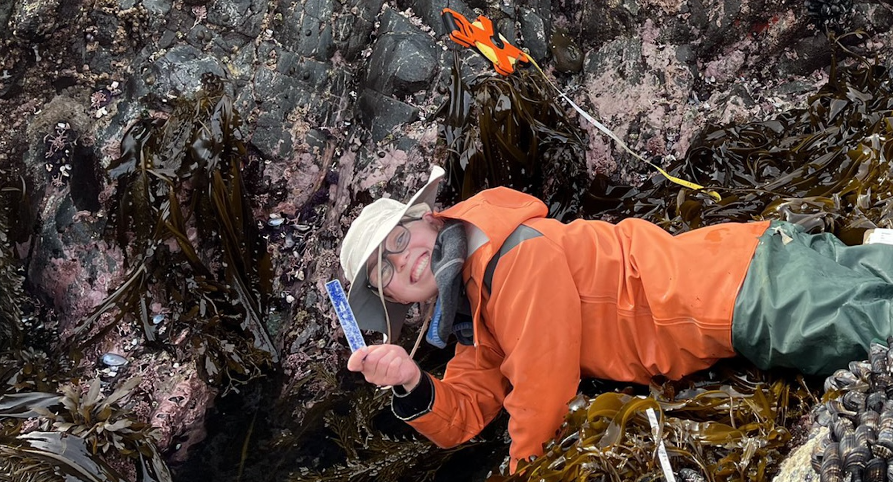

## Mads  Abbott

```{r, echo=FALSE, out.width="75%", out.height="75%"}

```

  I am currently a MSc. student working in the [Bates Ocean Conservation Lab](https://www.oceanconservationlab.com/) at the University of Victoria, in Beautiful British Columbia Canada. My primary interest is in the parasites/diseases found in marine invertebrates, but extends to marine ecology and climate change research generally. I graduated with a BSc. honours from the University of British Columbia where I completed a thesis on hermit crab parasites in the Harley Lab. Following this, I spent a few years working as a research technician. I had the opportunity to work as a seasonal technician for Menge Lab's PISCO long term intertidal monitoring projects, and then as a technician for the Silbiger lab where I worked on an NSF project aimed at uncovering the influence of intertidal foundation species on water biogeochemistry. As a grad student, I hope to get in the field whenever possible and improve my skills in statistical modeling. 


