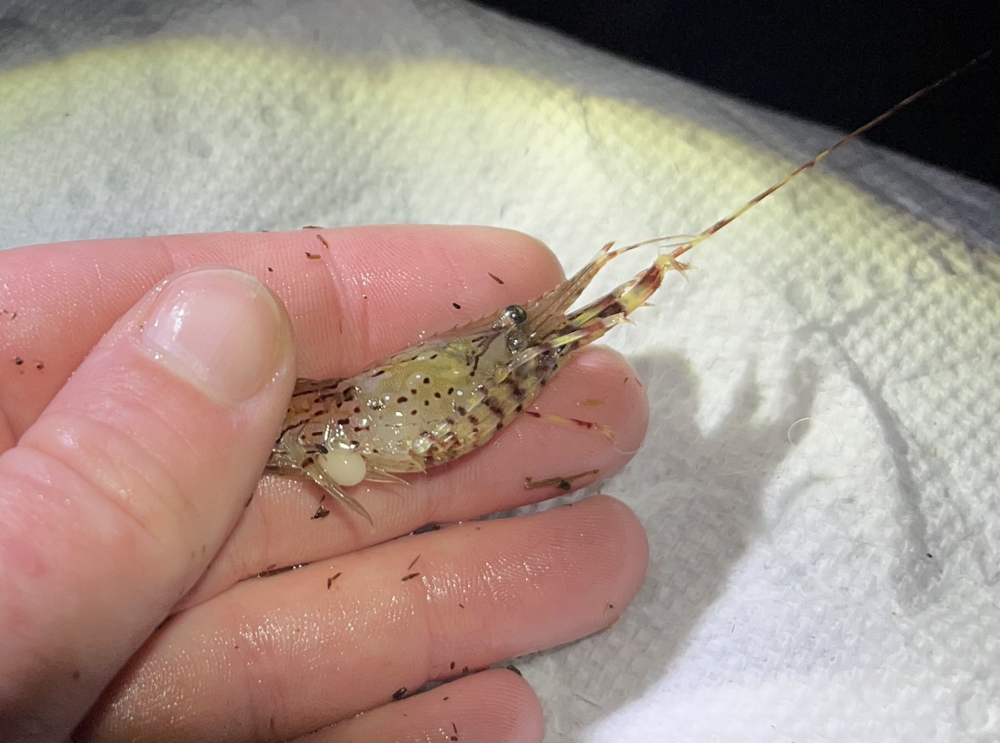
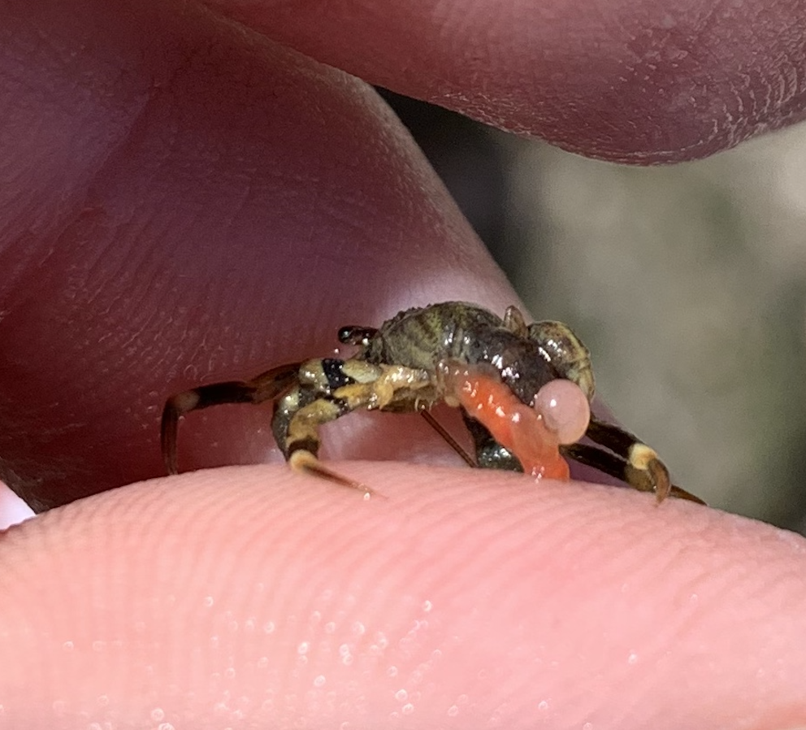
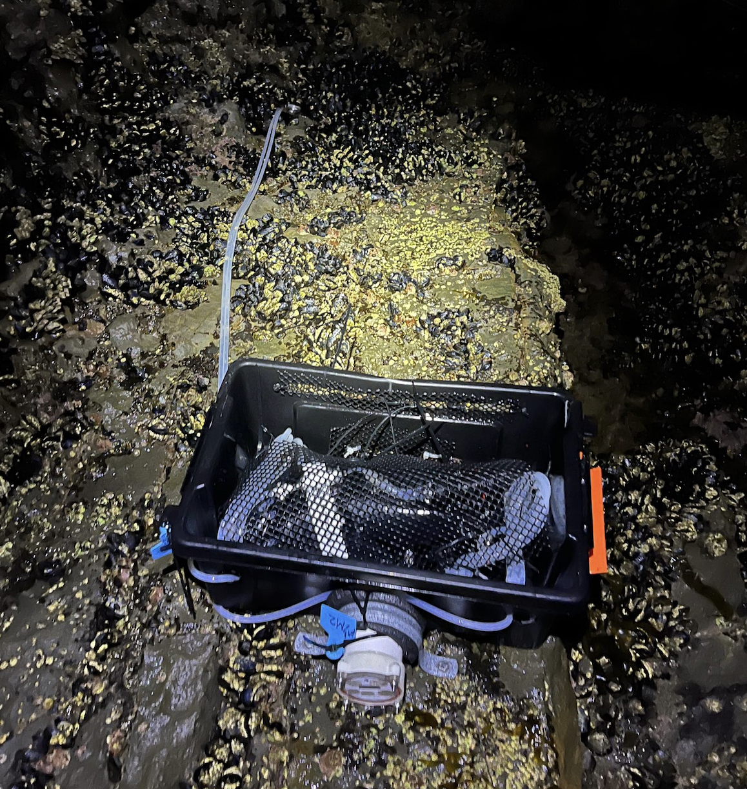
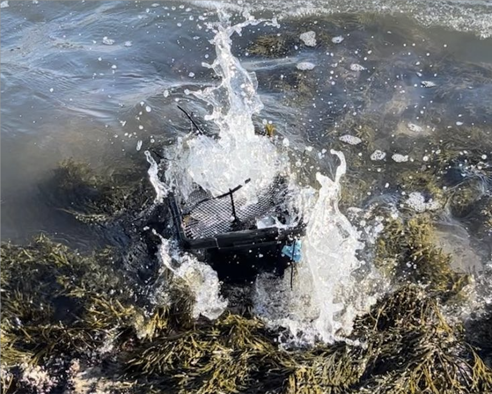

## Sylon disease ecology

```{r, echo=FALSE, out.width="75%", out.height="75%"}

```

My current research focuses on the ecology of Sylon in BC shrimp and prawns. I aim to increase our understanding of these unusual body snatching parasites through local field surveys, spatio-temporal analysis of large scale parasite distribution datasets, and experimental work in mesocosms. If you're a UVIC undergraduate and interested in helping with some of this work, please reach out!

## Hermit crab parasites

```{r, echo=FALSE, out.width="50%", out.height="50%"}

```

During my undergraduate at University of British Columbia, I had the opportunity to conduct field work and laboratory work exploring the parasites of the hermit crab Pagurus hirsutiusculus in the [Harley lab](https://www.zoology.ubc.ca/harleylab/). We found that multiple species of parasite are present in this host across BC, and discovered that while rhizocephalan infection may not alter host metabolism, it could decrease host survival after heating events. Read about it more [here](https://journals.plos.org/plosone/article?id=10.1371/journal.pone.0335145)

## Intertidal water biogeochemistry


```{r, echo=FALSE, out.width="50%", out.height="50%"}



```


While I was a technician for the [Silbiger lab](https://nyssasilbiger.com/) at California State University Northridge, I led field work and lab work aimed at determining the effect of intertidal foundation species on the surrounding water chemistry. What made this work both exciting and challenging, is that we sampled during high tide so had to install automated water samplers in the turbulent California rocky intertidal zone. 


